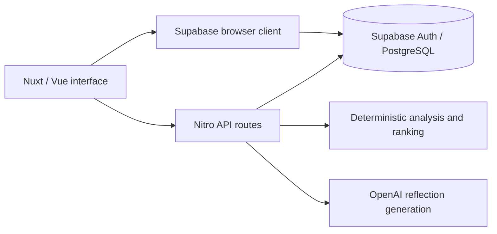

# Halo

**Small changes. Personal evidence. Room to reflect.**

Halo is a personal wellness experimentation app that connects daily check-ins with small experiments, measured changes and how those changes felt. It helps you learn what may be worth repeating.

## Why Halo

Collecting wellness data is easier than deciding what to do with it. Halo brings observations and reflection together so a sleep number or habit streak can become a practical question: *Did this small change seem to help, and was it sustainable?*

## The Core Loop

**Check in → notice patterns → try one small experiment → compare baseline and intervention → record how it felt → decide what to repeat or change.**

During an experiment review, Halo asks how it felt **before revealing the numerical result**, giving personal experience its own place in the process.

## Key Features

- **Daily check-ins:** optional sleep, movement, hydration and outdoor measures; 1–5 mood, energy and stress ratings; an evening reflection.
- **Habits:** daily or weekly routines, weekly targets, completion tracking and archive/restore controls.
- **Personal experiments:** focused changes with baseline comparisons, subjective reviews, notes and history.
- **Dashboard and reports:** daily snapshots, custom SVG trends and 7/14/30/90-day reports with calm and advanced views.
- **What Works:** descriptive comparisons between better days and other recorded days, with evidence labels.
- **AI-assisted reflections:** contextual daily and weekly summaries and suggested weekly goals.
- **Next Focus:** ranked suggestions for a small next experiment, informed by recent data and previous experiments.

## Personal Experiments

Try a steadier sleep routine, a short outdoor break or more consistent hydration. Choose a target such as energy or stress, keep checking in, then compare the experiment period with the preceding baseline. Record whether it felt better, unchanged or hard to maintain, and what you would try next.

These are personal before/after observations, not proof of causation. Other events and missing check-ins can affect the comparison; Halo does not independently verify adherence. A modest or inconclusive result can still be useful. Halo supports personal reflection and does not provide medical advice.

## AI in Halo

AI provides contextual reflection and suggestions through server-side OpenAI calls. It can summarize daily and weekly context, suggest goals and write an experiment conclusion. There is no conversational chatbot interface.

Numerical comparisons and the dashboard's Next Focus ranking use deterministic application/database logic, separate from AI narration. Generated text interprets context; it does not calculate the underlying evidence or establish causality. Evidence consistency remains an area of ongoing work.

Generating reflections sends relevant wellness context, including journal excerpts, to OpenAI. Saving a check-in currently also requests a daily reflection.

## Screenshots

Planned captures use synthetic data:

| View | What it shows |
| --- | --- |
| Dashboard | Today's snapshot, habits, trends and an active experiment |
| Mobile check-in | Optional measurements and a short reflection |
| Experiment review | Baseline comparison alongside personal reflection |
| Reports | Trends, habit consistency and descriptive patterns |

See the [screenshot preparation plan](docs/PORTFOLIO_SCREENSHOT_PLAN.md) for capture states and dimensions.

<!-- Uncomment each image only after its file has been added.


-->

## Tech Stack

Nuxt 4 · Vue 3 · TypeScript · Tailwind CSS · Supabase Auth · PostgreSQL / Supabase · Nitro server routes · OpenAI SDK · Zod · custom SVG visualizations.

## Architecture



The browser client handles simple user-owned data operations. Authenticated Nitro routes orchestrate reports, experiment transitions, analysis and AI generation. Shared experiment state lives in Nuxt `useState`; database policies govern access to persisted data.

## Engineering Decisions

- **Separate evidence from narration.** Deterministic analysis and ranking can be inspected independently of model-generated prose.
- **Allow incomplete days.** Optional check-in fields preserve missing values; the daily snapshot distinguishes missing data from zero.
- **Ask before revealing.** Subjective review precedes the numerical experiment result.
- **Keep experiments focused.** The normal start flow supports one active experiment and asks before replacing it.
- **Use lightweight charts.** Custom SVG sparklines fit the compact dashboard without a large chart library.
- **Keep provider credentials on the server.** OpenAI calls run through Nitro routes.

## Local Development

Use **Node 22.12.0** and npm. A **configured Supabase project is required**, including the tables, policies and SQL functions the app expects. A blank project plus environment variables is insufficient. Full version-controlled reproduction of the hosted database is still work in progress; the repository's database foundation is incomplete. Docker is not required to run the app against an already configured backend.

Create a Git-ignored `.env` with these variable names and your own configuration:

| Variable | Purpose |
| --- | --- |
| `NUXT_PUBLIC_SUPABASE_URL` | Supabase project URL |
| `NUXT_PUBLIC_SUPABASE_ANON_KEY` | Public Supabase anon key |
| `NUXT_OPENAI_API_KEY` | Private server-side key for AI generation |

Allow `http://localhost:3000/auth/callback` in the project's Supabase authentication redirects, adjusting the origin if using another port. Use the public anon key, never a service-role key, for browser configuration.

```bash
npm ci
npm run dev
```

Open `http://localhost:3000/auth` and sign in with an email magic link. Without an OpenAI key, AI generation is unavailable; check-in saving can report a generation error after the data has already saved.

```bash
node scripts/verify-phase1.mjs
npm run build
npm run preview
```

The regression script covers selected stabilization fixes. The build produces a Nitro server; a static-only host cannot serve the authenticated API routes. Configure the same environment variables in deployment. Build success is not a full typecheck or an authenticated end-to-end test.

## Project Status

Halo is an evolving personal product and portfolio project. The main product flows are implemented, with current work focused on reliability, evidence quality and polish. Some multi-step saves and experiment review contracts still need consolidation; database reproducibility and authenticated demo verification remain incomplete.

## Roadmap

- Make experiment evidence and review persistence consistent.
- Strengthen regression coverage for complete user journeys.
- Refine mobile usability and accessibility.
- Complete database reproducibility.
- Capture richer experiment adherence and context.

## About

Halo is a personal project exploring full-stack product engineering with Vue/Nuxt, TypeScript and Supabase. It brings together product and UX design, data interpretation and practical AI integration around a small, repeatable learning loop.
