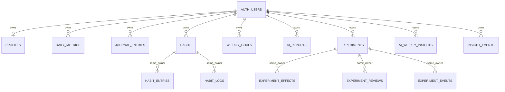

# Halo Database Foundation

## Executive Summary

28 September 2026. **Reproducibility: Partially — an inferred clean-database baseline is now defined, but has not been executed here; the deployed database and three essential RPC implementations remain unrecovered.** It is not a full hosted clone or a complete working analytics backend.

Reviewed `HALO_FULL_AUDIT.md`, `HALO_PHASE1_STABILIZATION.md` and all database call sites. Found **14 named relations, 3 RPCs, 99 call sites, 7 application upsert calls / 6 distinct conflict contracts**. See [the complete call-site inventory](HALO_DATABASE_CALLS.md), generated by `scripts/inventory-database.mjs`. Existing application changes were preserved; this phase changes no UI, AI, analytics, experiment routes or persistence workflows.

No live database was queried or modified. The environment exposes public Supabase URL/anon-key variable names and a private AI-key variable name, but no DB password/connection string or management credentials. Supabase CLI, Docker and psql were not found in PATH; no local Supabase config, CLI binary, linked metadata or `~/.supabase` directory existed. No callable Supabase metadata connector was available. Public REST credentials are not sufficient to recover policies, triggers, grants or function bodies. No keys, URLs, personal records or private connection strings were printed. No system-wide tools were installed.

The three migrations are **new inferred definitions for a clean isolated Supabase database**, not confirmed existing constraints or a deployment plan. Required upsert keys and owner-compatible relationships are explicit; stricter domain checks and the active-experiment unique index remain proposals outside the migration runner. Existing-data compatibility was not established.

## How the Database Is Used

- Browser Supabase client: onboarding profile reads/updates; habit reads/creation/archive; check-in metric/journal writes; dashboard/weekly AI report reads. `pages/habits.vue` archive updates filter only `id`, making DB ownership enforcement essential.
- Nitro handlers use session-scoped `serverSupabaseClient` / authenticated claims, rather than a service-role bypass. They read user data, orchestrate experiments and write AI reports and weekly insights.
- PostgREST relationship embedding (`experiments!inner`) requires a discoverable FK from effects to experiments (`server/lib/ai/buildLeverSummary.ts:27`, `server/api/ai/insights/lever-summary.get.ts:36`). The baseline uses one composite FK, avoiding ambiguous duplicate parent relationships.
- No alternate schema selectors, direct SQL driver, database migration, DDL, or additional dynamically named table/RPC dependency was found by the whole-repository search. Auth calls are managed Supabase Auth, not custom SQL tables. No application storage bucket dependency was found.
- Destructive multi-step writes remain as audited: `habits/log-today.post.ts`, `goals/weekly.post.ts`, `experiments/start.post.ts`. This phase does not make them atomic.

## Tables

All types, defaults and nullability below are **inferred choices in the new baseline**, not deployed metadata. Full column definitions are in `supabase/migrations/20260928000100_inferred_core.sql`. The inventory lists every query and exact source line, including alternate/unused routes.

Conventions: all tables except profiles have `id uuid primary key default gen_random_uuid()` and required `user_id uuid`; these IDs/defaults are inferred where writers omit them. Profiles use the auth UUID as their primary key. `created_at timestamptz not null default now()` is included except on `profiles`, `habit_logs`, `experiment_effects`, `ai_weekly_insights`; the latter explicitly writes `computed_at`. Extra generated IDs/timestamps are local baseline choices, not evidence of deployed columns. JSON objects use `jsonb`, numeric measurements/averages use `double precision`, ratings/counts use integers, date-only windows use `date`. No numeric wellness default fills missing data.

| Table | Reads and mutations establishing contract | Required fields beyond ID/owner | Nullable fields and defaults |
| --- | --- | --- | --- |
| profiles | `composables/useOnboarding.ts:19,42`: SELECT and UPDATE; no app INSERT/DELETE | `onboarding_completed boolean` | default false; missing profile is a supported session-only guide fallback, provisioning unknown |
| daily_metrics | Browser `pages/check-in.vue:437,522` SELECT/UPSERT; dashboard `pages/index.vue:447,480`; reports overview, daily/weekly AI, weekly compute, next-focus, end/review utility read windows | `date` | nullable sleep_hours, mood, energy, stress, steps, water_liters, outdoor_minutes, habits_summary/status (text); no measurement defaults |
| journal_entries | `pages/check-in.vue:456,533,541` SELECT/UPSERT/DELETE; daily/weekly summary and weekly goals read | `date,type text,content text` | no nullable application payload; type currently evening, not constrained to it |
| habits | `pages/habits.vue:267,317,345,364` SELECT/INSERT/UPDATE; habits endpoints, reports, AI, experiment start read | `name,category,frequency text`, `target_per_week integer`, `archived boolean` | default target 5, archived false; readers tolerate historical null archived, which baseline does not create |
| habit_entries | `habits/today.get.ts:32` SELECT; `toggle.ts:35,41` UPSERT/DELETE; `log-today.post.ts:39,56,64` DELETE/INSERT; reports/daily/weekly AI read | `habit_id uuid,date,completed boolean` | completed defaults true; writes explicitly supply true; readers tolerate null legacy completion |
| habit_logs | `ai/weekly-goal-suggestions.post.ts:115` SELECT only; no writer or synchronization found | `habit_id uuid,date` | completed nullable; separate inferred table, relation might actually be a hosted view; no invented unique key or mirroring trigger |
| weekly_goals | `goals/weekly.get.ts:29` SELECT, `weekly.post.ts:42,66` DELETE/INSERT; daily AI reads | `week_start,title text,category text,status text` | description nullable; category other/status pending defaults; multiple rows per owner/week |
| ai_reports | Browser check-in/dashboard/weekly card reads; `daily-summary.post.ts:407`, `weekly-summary.post.ts:226` UPSERT | `date,period text,content text` | content is daily Markdown or serialized weekly JSON, never fabricated default content |
| experiments | start SELECT/UPDATE/INSERT; end/review/resume SELECT/UPDATE; active/history/recent-levers/next-focus/pattern queries SELECT | `title,lever_type,target_metric,status text,start_date,baseline_days,recommended_days,effort_estimate,expected_impact,confidence` | nullable lever_ref text, end_date, hypothesis, outcome jsonb, what_worked/try_next text arrays. Defaults active/30/7/moderate/moderate/low mirror start payload; updated_at defaults now but has no auto-update trigger |
| experiment_effects | review.get SELECT metrics/windows; lever summary joins parent; weekly compute SELECT experiment_rows; health count; RPC is only intended writer | `experiment_id uuid,metric_key text,method_version integer` | nullable baseline_avg,experiment_avg,delta; baseline_rows,experiment_rows; baseline_start/end,experiment_start/end. No guessed computation/default/count semantics |
| experiment_reviews | `review.post.ts:213` UPSERT; `reviews.get.ts:20` SELECT sorted by created_at | `experiment_id,baseline_rows,experiment_rows,baseline_from/to,experiment_from/to,confidence text,alignment text,metrics jsonb` | nullable subjective_rating,subjective_note,conclusion text; writer can send null subjective data |
| experiment_events | end/review/resume INSERT, best effort; no app read/update/delete | `experiment_id,type text,payload jsonb` | created_at generated; no restrictive event enum invented |
| ai_weekly_insights | `weekly-insight.compute.post.ts:146` UPSERT; `weekly-insight.get.ts:23` SELECT; health reads | `week_key text,window_start/end,drift jsonb,gate jsonb,next_focus_options jsonb,computed_at timestamptz` | no dummy JSON or default computed timestamp; writer supplies every field |
| insight_events | `weekly-insight.compute.post.ts:168` INSERT; health SELECT created_at/kind | `kind text,payload jsonb` | created_at generated |

`steps` currently means movement minutes in the UI; do not rename/reinterpret historical values here. Sleep quality is not a current check-in field and is not invented in SQL. Input ratings can be null; empty optional measurements stay null.

Known incompatible query: `server/api/ai/experiments/[id]/history.get.ts:82` selects review-shaped columns (`experiment_id`, alignment, subjective_rating, baseline/experiment windows, metrics, conclusion) from experiments while mapping different experiment fields. Those unsupported columns are **not added** to disguise the route bug. Top-level note arrays in experiments are retained because the live review reader asks for them; no trigger synchronizes outcome notes. A later DTO phase must resolve this explicitly.

## Relationships

Every owner references `auth.users(id)`. The baseline proposes cascading owned-data deletion for isolated use, not a confirmed retention policy. Habit children reference `(user_id,habit_id)` → habits `(user_id,id)`; experiment children reference `(user_id,experiment_id)` → experiments `(user_id,id)`. Parent pairs have UNIQUE keys supporting these FKs. All ownership columns are required. Cascades remove dependent children; no app delete-account or delete-experiment workflow is introduced.



The review unique key limits each owned experiment to at most one review row despite the plural API/table name. Every child also has its own auth-user FK. `lever_ref` is polymorphic text: metric key, habit UUID string or custom value. It is intentionally not shown as a real habit FK. DB enforcement of habit-lever ownership remains a documented gap/proposal.

## Ownership Model

Authenticated JWT subject maps to PostgreSQL `auth.uid()`. Profile owner column is `id`; all other relations use `user_id`. Application UID filters alone do not establish isolation. The baseline keeps SELECT ownership checks in PostgreSQL; INSERT and UPDATE require the supplied/new owner to equal `auth.uid()`. UPDATE checks both old and new row. Child-parent same-owner integrity uses composite FKs in addition to RLS, preventing a caller from inserting an own-owned child pointing to someone else's habit/experiment.

Database owners and service roles can bypass ordinary RLS; neither is used for the authorization assertions or fixture writes. Access by those privileged roles is not proven safe merely by having policies. The inferred grants allow owners to modify their own generated reports/effects/events; this supports the current session-scoped writer model but is not tamper-proof evidence or append-only audit storage. Narrower write rights require recovering actual RPC execution rights and designing that boundary separately.

## Upsert / Conflict Contracts

All seven matches in application source are listed here. Each key is **required by source, unverified in hosted PostgreSQL, defined in the inferred local SQL**.

| Operation | File / call-site | Table | Expected unique conflict key |
| --- | --- | --- | --- |
| Save daily check-in | `pages/check-in.vue:523` | daily_metrics | user_id,date |
| Save evening reflection | `pages/check-in.vue:534` | journal_entries | user_id,date,type |
| Toggle habit on | `server/api/habits/toggle.ts:36` | habit_entries | user_id,habit_id,date |
| Store daily AI | `server/api/ai/daily-summary.post.ts:408` | ai_reports | user_id,date,period |
| Store weekly AI | `server/api/ai/weekly-summary.post.ts:227` | ai_reports | user_id,date,period |
| Finalize review snapshot | `server/api/ai/experiments/[id]/review.post.ts:214` | experiment_reviews | user_id,experiment_id |
| Store computed weekly insight | `server/api/ai/weekly-insight.compute.post.ts:147` | ai_weekly_insights | user_id,week_key |

`upsert_experiment_effects_v1` implies a database write but its internal conflict key is **unknown**; `(experiment_id,method_version,metric_key)` is only a candidate. No extra effect UNIQUE is silently installed. Goals are replacement inserts, not upserts, and must allow several rows per week. New seed-script upserts use existing primary/conflict keys and are not additional application dependencies.

## RPC Functions

No function SQL, deployed privileges, volatility, overloads, defaults or search paths were recovered. Numeric parameter types below are suggested by JavaScript integer arguments, not verified PostgreSQL signatures. **No fake implementations or success-returning stubs were created**; analytics formulas remain untouched.

| RPC | Callers and argument contract | Consumed return shape | Authorization requirement / unknown |
| --- | --- | --- | --- |
| get_what_works | `server/api/what-works.get.ts:84`; `p_window_days` and `p_min_n` numbers (defaults in caller 30/4) | row array: lever, lever_type numeric/boolean, diff, avg_good, avg_base, nullable cohen_d, confidence learning/moderate/strong | no owner parameter; must derive auth.uid internally or rely on properly scoped invoker RLS. Better-day grouping, formula, habit denominator and SQL rights unknown |
| get_metric_correlations | `server/api/ai/insights/correlations.get.ts:20` and `weekly-insight.compute.post.ts:76`; p_user_id UUID subject, p_window_days, p_min_n | metric_x,metric_y,n,corr_value row array; weekly compute consumes n | API passes own subject, but direct RPC clients can substitute B's UUID. Require authenticated caller AND p_user_id = auth.uid(), or equivalent owner-scoped invoker behavior. Pairing/date/null/count rules unknown |
| upsert_experiment_effects_v1 | `server/api/ai/experiments/[id]/end.post.ts:247`, `recompute-effects.post.ts:32`; p_experiment_id UUID, p_method_version=1 | callers inspect error only; scalar/void/row return unknown. Expected side effect: owner-linked effect rows read by review/pattern endpoints | require referenced experiment owner = auth.uid(); explicit route ownership checks do not protect direct RPC calls. Must constrain every written owner/parent. Window/calculation/idempotency/version contracts unknown |

Prefer SECURITY INVOKER with RLS where compatible with recovered SQL. Any SECURITY DEFINER function needs an explicit auth/owner check, fixed safe search_path, fully qualified objects, reviewed owner, and narrow EXECUTE grants (revoke PUBLIC/anon, grant intended role). Also inspect helpers/views called by each RPC, not only top-level bodies. Function rights can bypass table protections; aggregate-only returns may still leak someone else's wellness data. See [Supabase functions documentation](https://supabase.com/docs/guides/database/functions).

Recovery: an authorized operator can run `supabase/inspection/metadata.sql` in a read-only session. It collects definitions and catalog metadata, including public views and public/auth-user triggers without querying user records. Review SQL text/defaults locally for embedded secrets before sharing. A read-only schema dump is another option once an approved connection is available; do not run remote migration pull/repair workflows that might alter migration history. Reconcile dependencies, then add recovered RPC migrations and reproduce them locally before generating complete types.

## RLS Model

`20260928000200_owner_rls.sql` enables RLS for all 14 relations, revokes existing table privileges from PUBLIC/anon/authenticated on the newly created tables and grants only SELECT/INSERT/UPDATE/DELETE to authenticated. No TRUNCATE, REFERENCES or TRIGGER grant is added for the client role. Four policies per table:

| Operation | Rule |
| --- | --- |
| SELECT | USING auth.uid() = owner |
| INSERT | WITH CHECK auth.uid() = owner |
| UPDATE | USING old owner and WITH CHECK new owner |
| DELETE | USING auth.uid() = owner |

No `USING(true)`, anonymous table access, service-role fixtures or RLS disablement is used. UUID defaults avoid application-owned sequence grants. Grants on schema public allow authenticated lookup, while table policies constrain rows. Managed auth schema privileges are not redefined. No global default-privilege changes are made: future tables/functions must explicitly set grants/RLS when introduced. See [Supabase RLS documentation](https://supabase.com/docs/guides/database/postgres/row-level-security).

**Security findings:**

- Confirmed source dependency: browser archive writes only use habit ID; review effects query filters experiment ID after checking the parent. Both rely on DB isolation.
- Potential hosted risks, not established exploits: absent/weak owner policies, owner-changing updates, cross-owner child references, RPC subject substitution, SECURITY DEFINER bypass and public EXECUTE. Hosted protection status is unknown.
- Protection defined in new SQL, not runtime-verified: all-table owner CRUD policies, no anon grants, composite parent ownership FKs.
- Known inferred-baseline gap: habit-type experiment `lever_ref` ownership is enforced only by the current start API, not the new SQL. Direct clients could reference another user's habit UUID as text. No ordinary FK solves a polymorphic reference; proposal is documented, not silently redesigned.

## Constraints & Invariants

**Confirmed existing hosted constraints: none available for inspection.** Source upserts require keys but do not prove those keys are deployed.

**Defined for clean local reconstruction:** profile/auth identity PK, UUID row PKs, non-null ownership, auth FKs, six application conflict keys, required write fields, owner-compatible parent FKs, and parent `(user_id,id)` uniqueness. No measurement values are defaulted. No hosted data has been checked against any of these choices. The cascade policy and required/null columns must be compared with recovered SQL before promotion.

**Recommended constraints, not established missing in production:** nullable 1–5 ratings, nonnegative finite wellness measurements, valid frequency/categories/statuses/periods/subjective ratings, chronological windows, valid experiment lever/catalog fields, positive baseline/duration values, effect version uniqueness and one active experiment. See `supabase/proposals/constraints.md`. These can reject historical or currently accepted requests, so they remain outside migrations.

Do not introduce profile/signup triggers, updated_at triggers, `habit_logs` mirroring or outcome-note synchronization without actual SQL evidence or a separately approved behavior change. The fixture script creates profiles through normal ownership policies, and current experiment writers explicitly update updated_at.

## Indexes

The primary and conflict keys create indexes automatically. The third migration adds query-support indexes:

- habits(user_id,created_at), habit_entries(user_id,date), habit_logs(user_id,date) and (user_id,habit_id).
- weekly_goals(user_id,week_start,created_at), ai_reports(user_id,period,date).
- experiments(user_id,status,start_date).
- experiment_effects(experiment_id,method_version,metric_key) and (user_id,experiment_id).
- experiment_reviews(user_id,created_at), experiment_events(user_id,experiment_id), insight_events(user_id,created_at).

These follow visible filters/joins/FK maintenance, not measured production query plans. Actual existing index names/coverage/cardinality are unknown. Do not duplicate matching hosted indexes on deployment.

## One-Active-Experiment Rule

Source states are **active, ended_pending_review, completed, abandoned**, not generic `pending_review`. Start checks status active AND end_date null before inserting; active.get filters only active. Resume clears end_date and sets active without checking for another active experiment. End sets ended_pending_review; finalize sets completed; replacement sets abandoned.

A read-then-write route check cannot establish concurrency safety. Whether PostgreSQL already enforces uniqueness is **unknown**. Proposed partial UNIQUE(user_id) WHERE status='active' matches the active reader and leaves unlimited legitimate non-active history. It is not applied in this phase. First reconcile multiple-active and active-with-end-date rows, then add the invariant alongside Phase B transactional start/resume and conflict handling. Adding end_date-null to the predicate would leave the active reader vulnerable to inconsistent multiple status-active rows.

## Generated TypeScript Types

No output is fabricated. `types/README.md` reserves/documented the configured path `types/database.types.ts` (Nuxt module already expects it) and gives `supabase gen types typescript --local --schema public` with a temporary-file success check. Automatic generation could not run without CLI/local DB. Local generated types will initially reflect the inferred subset and omit missing RPCs. Recover RPCs, regenerate, then assess `never`/unknown errors and real query/DTO errors separately. Merely generating types does not repair the bad history query or undefined `uuid` in the health route.

## Migration Structure

| Added file | Purpose |
| --- | --- |
| `supabase/config.toml` | Dedicated local project/ports, Postgres 15 chosen for local use (hosted version unknown), local auth redirects, opt-in fixture seeding |
| `supabase/.gitignore` | Exclude local CLI linkage/cache branches |
| `supabase/migrations/20260928000100_inferred_core.sql` | 14 inferred tables, source conflict keys and ownership-compatible relationships |
| `supabase/migrations/20260928000200_owner_rls.sql` | Explicit CRUD policies and client table grants |
| `supabase/migrations/20260928000300_query_indexes.sql` | Indexes for current query shapes |
| `supabase/proposals/constraints.md` | Deferred validation, one-active SQL and production compatibility strategy |
| `supabase/inspection/metadata.sql` | Read-only catalog inventory / SQL recovery, no records |
| `supabase/inspection/compatibility.sql` | Optional aggregate-only duplicate/owner/range/date/reference preflight after schema review |
| `supabase/tests/database/ownership.test.sql` | Rollback-only synthetic two-user pgTAP table tests |
| `supabase/README.md` | Exact local setup, limitations, seed and type-generation workflow |
| `scripts/seed-local-database.mjs` | Loopback-only fixture writer using regular Auth and RLS |
| `scripts/inventory-database.mjs` | Reproducible source call-site inventory, no environment/DB access |
| `types/README.md` | Generated types TODO and command, no fake output |
| `docs/audit/HALO_DATABASE_CALLS.md` | Exhaustive source references and query chains |
| `docs/audit/HALO_DATABASE_FOUNDATION.md` | This report |

No packages, lockfiles or application code were changed. No RPC migration is supplied because inventing algorithms would violate this phase's scope. Clean migrations deliberately lack IF NOT EXISTS so a mismatched pre-existing schema fails rather than being silently accepted.

## Synthetic Data / Seed Strategy

Opt-in `scripts/seed-local-database.mjs` accepts only the standard loopback API at port 54321; it does not read `.env` and rejects redirects/embedded URL credentials. Uses public local key, ordinary signup/login and RLS-bound REST operations. No service-role key, copied record or hosted user is used.

Two synthetic accounts receive profiles, 35 daily rows ending 2026-09-28, two habits, 70 completion rows and one active custom experiment each. Includes nulls, zeros and variable scores, without precomputed effects or invented AI/causal claims. Fixed dates make the fixture deterministic and may require selecting historical report windows. Re-running resets known fixture values and experiment state, so use only a disposable local stack. `habit_logs` intentionally stays empty rather than pretending current writes synchronize it. Auth email-confirmation bypass is local config only; use local mail tooling for magic-link UI flows. Creation of real hosted users is not part of this script or phase.

## Two-User Authorization Test

Concrete local sequence (prerequisites absent here):

```sh
supabase start
supabase db reset --local
supabase test db
# Set HALO_LOCAL_URL=http://127.0.0.1:54321 and the LOCAL public anon key privately.
node scripts/seed-local-database.mjs
```

Never add --linked or a hosted --db-url. The reset command is intentionally destructive only to the disposable local stack. See [Supabase migration workflow](https://supabase.com/docs/guides/local-development/database-migrations) and [database tests](https://supabase.com/docs/guides/database/testing).

The pgTAP suite creates synthetic Auth subjects inside a transaction, seeds B's records as setup, then switches to the actual authenticated role with A's claims. It verifies each of the 14 tables: no B read/update/delete, rejected insert-as-B, successful A insert/read/update, rejected owner transfer (to a third subject to avoid PK-conflict false positives), B still sees own original row, A can delete own rows in dependency order. It checks RLS flags, anonymous SELECT denial, cross-owner child FK violations, daily upsert/zero preservation and duplicate rejection. All setup and tests roll back. Unexpected authorization SQLSTATEs fail tests. It is a database integration test definition, **not an executed/passing result**.

After local seed, repeat through PostgREST using each account's access token (not the service key): attempt SELECT/PATCH/DELETE on B UUIDs with A token; expect empty results/zero affected rows. POST a B owner payload must fail. Upsert attempts targeting B conflict keys must fail. Submit own child owner with B habit/experiment ID; expect FK violation. Repeat A/B swapped and with anon token. Confirm normal own-row operations succeed and no error includes private row content. This exercises HTTP auth plumbing beyond SQL claims.

### Required direct RPC authorization checks (blocked until definitions recovered)

Use an isolated fixture DB, authenticate as A and invoke the function directly, bypassing Nitro. Under SQL tests use `SET LOCAL ROLE authenticated` and both `request.jwt.claims` / `request.jwt.claim.sub` as in the supplied table suite. Exact named argument probes:

```sql
select * from public.get_what_works(p_window_days => 30, p_min_n => 4);
select * from public.get_metric_correlations(
  p_user_id => 'bbbbbbbb-bbbb-4bbb-8bbb-bbbbbbbbbbbb'::uuid,
  p_window_days => 30, p_min_n => 3);
select public.upsert_experiment_effects_v1(
  p_experiment_id => '20000000-0000-4000-8000-000000000009'::uuid,
  p_method_version => 1);
```

These UUIDs refer to B in the SQL fixture suite. Use the seed's actual B IDs if running outside that suite; do not use production identifiers. Verify B-substitution is rejected or returns no B data, and that effects are unchanged for B. For get_what_works, compare A results with B absent/present and after changing only B fixtures; A output must be unchanged. Repeat correlations with own A subject (succeeds), B subject (no leakage), anon/no claims (denied), and swapped subjects. Own effects recompute must succeed and be repeatable under the recovered contract; cross-owner calls must not write any row. Assert no PUBLIC/anon EXECUTE grants and inspect all overloads/search_path/definer flags. Missing functions are a **blocked test**, never a security pass. Actual SQL return types may require adapting `select *` after recovery.

## Existing-Data Compatibility Risks

No hosted user data was examined, even in aggregate. A clean baseline says nothing about existing duplicate daily rows, null owners, invalid ratings, orphan/mismatched FKs, duplicate reviews/effects, extra statuses or multiple active experiments. Existing `habit_logs` might be a view; current IDs, numeric types/defaults and note storage may differ. Trigger-maintained fields may exist but are unknown. No hosted PostgreSQL major version was verified.

Before production: recover metadata; compare definitions and grants; privately run aggregate preflight with authorization broad enough to avoid RLS-hidden violations; check null required values and missing auth-user references for every table; extend preflight for recovered types/enums/triggers. The supplied preflight covers duplicates, null ownership, measurement bounds, status/dates and child ownership but is not an exhaustive migration acceptance test. NaN/infinity, window/count validity, target catalogs and cascade/retention behavior need type-aware follow-up.

Agree non-destructive repair decisions before enforcing keys/checks. Never automatically discard duplicate wellness records. Rehearse additive forward migrations against the recovered schema and synthetic conflicting cases, with backup/rollback and locking plans. Where applicable, use NOT VALID followed by VALIDATE for checks/FKs; unique keys require prior duplicate resolution. Do not run clean CREATE TABLE migrations on production or mark them applied just to bypass conflicts. Deploy application conflict/error handling before enabling constraints that can reject its existing flows.

## Confirmed vs Inferred Database Behavior

| Evidence class | Result |
| --- | --- |
| Confirmed deployed SQL/database metadata | **None recovered.** No conclusion that hosted RLS/keys/RPC authorization is absent or correct. |
| Confirmed application source | Named tables/RPCs/columns, seven upsert calls and conflict strings, four experiment states, current direct browser access and multi-step writes. |
| New SQL definitions reviewed as files | 14 tables, owner policies/grants/FKs/conflict keys and supporting indexes; these are proposed local reconstruction, not observed deployed behavior. |
| Executed checks | Source inventory: 14 tables / 3 RPCs / 99 calls; JavaScript syntax checks, local-seed refusal checks and whitespace checks (see verification below). |
| Not executed | Clean migrations, pgTAP/RLS checks, seed against a server, generated types, hosted SQL recovery, direct RPC authorization and authenticated UI workflow. |

### Verification result

- `command -v supabase`, `command -v docker`, `command -v psql`: unavailable.
- `node scripts/inventory-database.mjs`: success on installed Node 22.12.0; inventory covers all literal call sites found in the independent repository search.
- `node --check scripts/inventory-database.mjs` and `node --check scripts/seed-local-database.mjs`: syntax validation only.
- Seed with missing environment and with a non-loopback test URL: intentionally fails before network access. No local or remote auth requests were made.
- Static inventory coverage confirms all 14 tables occur in the baseline, RLS list and authorization fixtures; all seven application upserts are inventoried. This checks coverage, not SQL semantics.
- `git diff --check` passed for tracked changes; a separate `git diff --no-index --check` against `/dev/null` covers each newly added file. An extra generated EOF blank line was removed before the final check.
- SQL has been reviewed statically, but no PostgreSQL parser/server was available. No claim that migrations or policy tests pass at runtime.
- No app build was rerun because this phase changes only database artifacts, scripts and documentation; Phase 1 production build result remains documented separately.

## Remaining Unknowns

RPC SQL/overloads/dependencies and exact return types; actual schema types/defaults/constraints/indexes; profiles trigger/provisioning; habit_logs relation type/synchronization; note storage synchronization; table/sequence/schema/function grants and RLS; deployed major version/extensions; unique active enforcement; actual ownership and historical compatibility; migrations apply and PostgREST composite relationship embedding on a real local instance. Full setup remains blocked until local tooling and recovered RPC definitions are available. These gaps are explicit, not replaced by invented generated types, algorithms or silent SQL triggers.

## Recommended Next Phase

Complete the remaining foundation gates first: run the clean local setup and pgTAP suite, recover/inspect RPCs, reproduce them without formula changes, verify direct RPC isolation and generate types. Then **Phase B — atomic persistence/data-loss protection**:

1. Block check-in save when required habit loads fail; distinguish “failed load” from authoritative empty completions.
2. Add narrowly scoped transaction functions for replacing a day's habit completions and a week's goals. Derive owner from auth.uid(), validate all input/parent ownership before deletion, deduplicate IDs, preserve prior records on any error, and test failure injection/concurrency.
3. Make experiment replacement one transaction: validate first, serialize per owner (e.g. transaction advisory lock or stable parent-row lock), abandon old and insert new atomically. Add reviewed one-active partial uniqueness and map conflicts to a controlled 409. Resume must respect the same invariant.
4. Run two-user tests on every new function, plus duplicate request, concurrent replacement, insert failure and rollback tests with synthetic fixtures. Decide idempotency/stable IDs explicitly; do not assume deletion/reinsertion is harmless.
5. Rehearse production-compatible forward migrations against recovered SQL; never promote the inferred clean baseline blindly.

No Phase B transaction or application persistence fix was implemented here. No commit or push was made.
