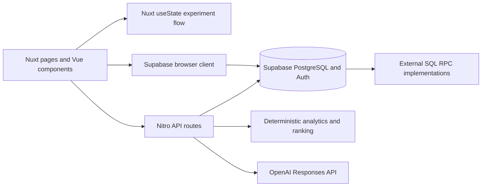

# Halo Tracker — Full Product & Technical Audit

Audit date: 24 September 2026. Scope: the working tree supplied for review, including the existing uncommitted changes to `components/dashboard/WhatWorksCard.vue` and `server/api/what-works.get.ts`.

## Executive Summary

Halo has a clear and worthwhile product identity: a calm personal wellness tracker that helps someone record daily experience, try a small change, and review what happened. Its strongest differentiation is the loop from **check-in → personal experiment → measured and subjective review → next focus**. This is substantially more interesting than another habit checklist or an AI chatbot wrapper.

The implementation supports much of that identity, but it is not ready for a public production launch. There are confirmed failures in the main journey, inconsistent interpretation of wellness data, non-atomic replacement writes, and an unsafe Markdown rendering boundary. The database implementation is absent from the repository, so authorization, constraints, RPC correctness, and clean setup cannot be independently established.

The production build **passes on the already-installed Node 22.12.0**. That is useful evidence, but does not mean the app works: the unauthenticated `/` route returns **HTTP 500**, and a supplementary server TypeScript check reports **151 diagnostics**. There are no project test, lint, or typecheck scripts.

Keep the architecture and visual direction. The next phase should be consolidation and reliability, not a rewrite or major feature expansion. Make one complete experiment journey dependable, with honest evidence labels and a reproducible database setup, then demonstrate it with synthetic data.

### Scope, method, and limitations

- Inspected every application source file in `pages/`, `layouts/`, `components/`, `composables/`, `app/`, `server/api/`, `server/lib/`, and `server/utils/`, plus configuration, styles, locales, documentation, public asset inventory, dependency manifest and lockfile metadata. Searched hidden/tracked files for tests, SQL, deployment configuration, environment templates, and repository guidance.
- Traced sign-in, onboarding, habit creation/archive/completion, check-in writes, reports, experiment start/end/review/history, weekly goals, AI generation, and both visible and alternative recommendation paths.
- Existing application edits were preserved. Only the two requested audit Markdown files are new deliverables. Build commands generated ignored artifacts.
- Did not authenticate as a user, send magic links, invoke paid model requests, mutate hosted data, or inspect personal wellness records. Environment **names only** were inspected; no secret values are included.
- Local HTTP inspection was possible; a browser automation tool and Playwright were unavailable. No rendered desktop/mobile screenshots, authenticated browser walkthrough, screen-reader audit, or measured color-contrast assessment was performed. Visual judgments below are implementation-based.
- No SQL schema, migrations, RLS policies, triggers, RPC definitions, seed data, or generated database types are included. Table names and fields below are **inferred contracts from queries**, not a verified database inventory. No cross-user disclosure is claimed.

## What Halo Is

Halo addresses the gap between collecting wellness numbers and deciding what small action is worth repeating. Its likely user is an adult interested in self-awareness and sustainable routines who wants enough quantified feedback to learn without turning daily life into a performance competition.

The value proposition is personal learning: record sleep, mood, energy, stress and habits; notice patterns; try one focused change; compare the result with an earlier period and with how it felt. The copy consistently favors gentle actions, rest, and imperfect consistency (`components/OnboardingModal.vue`, `pages/science.vue`).

Implemented capabilities include:

- Email magic-link authentication and an onboarding-completed profile flag.
- Daily self-reported sleep hours, movement minutes, water liters, outdoor minutes, and mood/energy/stress on a 1–5 scale; an optional evening reflection.
- Habits with categories, daily/weekly frequency, weekly targets, archiving/restoration, and per-day completion.
- Dashboard snapshots, SVG trends, reports for selected windows, descriptive correlations, and a “What Works For You” card.
- Experiments with a lever, target metric, baseline window, suggested duration, active/pending/completed/abandoned states, history, subjective rating, notes, and a conclusion.
- Daily and weekly generated reflections and suggested weekly goals.
- Deterministic next-focus ranking using recent changes, sample-count gating, novelty, and previous experiment patterns.

There is no separate conversational AI Coach page, chat history, wearable integration, symptom model, tags model, or clinical recommendation system. “AI Coach” describes generated reflections and suggestions embedded in the product. Settings currently only reopens onboarding.

## Current Product Experience

### Main journey, traced through the implementation

| Step | Actual implementation | Assessment |
|---|---|---|
| Sign in | `pages/auth.vue` calls `signInWithOtp`; `/auth/callback` reads the authenticated user and navigates home | A focused passwordless flow; expired-link recovery is just an error message. Hosted redirect/email configuration is outside the repo. |
| Understand Halo | `layouts/default.vue` loads `profiles.onboarding_completed`; `OnboardingModal.vue` explains the philosophy | Good tone, but it gives little practical guidance for the experiment loop. A missing profile row causes a null dereference. |
| Define habits | `pages/habits.vue` directly creates and archives/restores Supabase rows | Useful and compact; archive failures are console-only. No editing of existing habit details. |
| Record today | `pages/check-in.vue` loads existing data and saves metrics, journal and habit completion, then calls daily AI | Central workflow exists, but partial writes and failed loads are not handled safely enough. |
| Read feedback | `pages/index.vue` loads snapshot/trends/AI and mounts independent cards | Strong content, too many competing suggestions, and a confirmed signed-out crash. |
| Start a change | `ExperimentStartDialog.vue` uses three metric presets; `NextFocusCard.vue` starts ranked presets through `useExperimentFlow` | Real workflow with replacement confirmation; different preset catalogs encode similar ideas differently. |
| End and review | `end.post.ts` snapshots before/after averages and calls the effects RPC; `ExperimentDialog.vue` asks how it felt before showing results | The best product interaction. Persistence and DTO disagreements weaken it. |
| Learn and repeat | History opens review DTOs; next focus uses experiment effects and correlations | The intended loop is present, but results, notes, confidence, and adherence are not yet one coherent evidence model. |

### Confirmed journey defects

1. **Signed-out home crashes.** `pages/index.vue:341` assigns a plain `uid`; `:582` evaluates `uid.value` in an immediate watcher. With no user, it dereferences `undefined`; with a user, the string is still not reactive. This was reproduced locally as HTTP 500. `/` is explicitly public in `nuxt.config.ts`.
2. **Partial check-ins can crash the snapshot.** Sleep is optional and stored as `null`, but `components/dashboard/DailySnapshotCard.vue:82` calls `sleepHours.toFixed(1)`. Vue prop defaults do not replace an explicitly passed `null`. Other missing scores become neutral-looking defaults. Sleep quality is displayed even though the check-in does not collect it; the parent substitutes zero.
3. **Failed habit loading can erase completions.** `loadHabitsForToday` catches errors by setting both lists empty and finishes loading. Save is then enabled. It sends `completedHabitIds: []`, and `log-today.post.ts` deletes that day's entries. A failure must not become authoritative empty input.
4. **Review notes are written and read from different places.** `review.post.ts` saves `outcome.what_worked` / `outcome.try_next`; `review.get.ts` reads top-level `experiments.what_worked` / `try_next`. No application synchronization exists. Unless an unprovided trigger synchronizes them, reopened notes disappear from the UI.
5. **Active experiment DTO mismatch.** `active.get.ts` returns `startDate` and `targetMetric`; `pages/check-in.vue` reads `start_date` and `target_metric`. Its experiment day becomes zero and target text is missing. The same snake-case assumption appears in the start-dialog replacement summary.
6. **Lowest-confidence signals display as “Strong.”** `WhatWorksCard.vue:73` accepts `low`, while its actual API/type uses `learning`. `prettyConfidence('learning')` falls through to “Strong.” The overall badge may simultaneously say “learning.” This applies to the supplied working-tree version.

## Architecture Overview

Nuxt supplies routing, SSR, server endpoints, auto-imports and shared state. The root-level pages/components/layouts are recognized by the current installation; the build confirms this. `app/router.options.ts` restores saved scroll positions and scrolls new navigations to the top. There is no custom application middleware, plugin directory, Pinia store, or separate backend service. Supabase module middleware supplies authentication redirects.

Using a Supabase browser client for simple user-owned CRUD and Nitro for orchestration is reasonable. It is secure only when database policies enforce ownership independently. Moving every query to Nitro would not solve missing policy evidence.

The biggest architectural issue is **multiple definitions of the same domain**, rather than the folder layout: metric metadata, confidence vocabularies, presets, review calculations, recommendation pipelines, and date helpers disagree across layers.

## Frontend Review

### Good foundations

- Composition API and focused display components are used throughout. The distinction between pages, dashboard cards, charts, and report tiles is understandable.
- `useExperimentFlow.ts` centralizes an explicit state machine in Nuxt `useState`, avoiding separate active-experiment copies across callers. Its request sequence prevents an older active-load response from winning.
- Habit completion is optimistic and rolls back on error (`pages/index.vue`, `toggleHabit`). Dashboard reads use `Promise.allSettled` so independent requests can run together.
- Forms support comma decimals for sleep/water, loading labels, disabled submission in several paths, and useful first-use links.
- Small SVG charts avoid introducing a large charting framework.

### Maintainability and correctness

`pages/index.vue` (589 lines), `pages/check-in.vue` (584), `ExperimentDialog.vue` (494), and `DailyInsightCard.vue` (418) mix data loading, interpretation, layout, dialogs and error handling. Line count alone is not a defect; concrete extraction candidates are shared metric metadata/formatting, check-in persistence, and review DTOs. Do not break every card into tiny components merely to shorten files.

Strict TypeScript is enabled, but widespread `any`, duplicated `Preset`/metric types, and missing Supabase database types prevent reliable end-to-end checking. `pages/index.vue` uses a `Preset` type without importing/exporting a shared definition. `ExperimentDialog.vue` accepts `flow: any` and emits an `openExperiment` event not declared in its emits type. These are precisely the boundaries where the observed contract bugs occurred.

Data fetching is inconsistent: `WhatWorksCard` uses SSR-aware `useFetch`; most cards load on mount; Reports runs an immediate watcher containing plain `$fetch`. Reports therefore performs an SSR internal request without explicitly forwarding session cookies, then fetches again on the client. Prefer `useFetch`/`useAsyncData` with request-aware fetching for SSR reads, or explicitly client-only fetching for a deliberate dashboard strategy.

`WeeklyAiReportCard.vue` awaits `useNextFocusSuggestions().loadNextFocus()` at setup, computes an unused `text`, and has no catch around that top-level await. Two unrelated API calls can prevent the reflection card from initializing. `NextFocusCard` recomputes and writes a weekly insight on every mount rather than loading the stored version.

Rapid Reports range changes have no cancellation or sequence guard; a slower previous request can overwrite the currently selected range. Experiment shared state has a sequence guard, but account changes/sign-out do not explicitly clear its user-specific context. This is an in-session stale-data risk, not evidence of cross-request SSR leakage.

## Backend / Supabase Review

All inspected API handlers check a server user before performing user-data work. Most derive ownership from the authenticated session and include `user_id` filtering. The installed `@nuxtjs/supabase` implementation of `serverSupabaseUser` calls `auth.getClaims()`; its payload has `sub`. The common `id || sub` fallback is compatible, but `insights/health.get.ts` still filters with `user.id` and separately references undefined `uuid`.

Good ownership checks exist before recomputing experiment effects and before starting a habit-linked experiment. Several handlers validate input with Zod. However, the browser can address Supabase directly, so handler validation and filters are not the final security boundary.

### Database evidence missing from the repository

No visible implementation establishes:

- RLS `USING` and `WITH CHECK` policies for each table and operation.
- Profile creation, foreign keys, delete behavior, date/metric bounds, defaults, unique indexes or the single-active-experiment invariant.
- Ownership enforcement inside `get_what_works`, `get_metric_correlations`, and `upsert_experiment_effects_v1`.
- Whether functions use invoker/definer rights, safe search paths, and restricted execution grants.

This is a **release-blocking verification and reproducibility gap**, not proof that hosted policies are absent. Supabase documents database RLS as the protection for browser-accessible tables: [Row Level Security](https://supabase.com/docs/guides/database/postgres/row-level-security).

### Integrity and API defects

- `goals/weekly.post.ts` and `habits/log-today.post.ts` delete before inserting. Insert failure loses the prior records; concurrent saves can interleave. Goal IDs also change on every replacement.
- `experiments/start.post.ts` abandons the existing experiment **before** validating the requested lever and before inserting its replacement. An invalid metric/habit reference can end a valid experiment and return an error without a replacement.
- Start performs read-then-insert single-active enforcement; resume does not check whether another active experiment exists. A database unique constraint/transaction may mitigate this, but is not visible.
- `end.post.ts` logs metric query failures and still persists an outcome; effects RPC errors are ignored. `review.get.ts` uses the effects table for numbers and outcome JSON for confidence/alignment, so the two can disagree. Retrying end returns early once `end_date` exists, leaving a failed effects computation unrepaired unless recompute is invoked separately.
- `habits/toggle.ts` reads `habit.archived` before checking `habitErr` or whether `habit` exists. A nonexistent or RLS-hidden habit yields a null dereference instead of a controlled 403/404.
- `insights/health.get.ts:25` uses undefined `uuid`; `lever-summary.get.ts` declares but fails to populate `targetMetric` in its aggregate object. Both are also flagged by the server compiler.
- `[id]/reviews.get.ts` ignores the path ID and returns this user's review list. `[id]/history.get.ts` also ignores the ID, selects review-like columns from `experiments`, then maps experiment fields it did not select. These routes are not the history endpoint used by the page, but remain published inconsistent contracts.
- Date strings are often only regex-validated or unrestricted strings; invalid calendar dates and end-before-start are not consistently rejected. Direct `.parse()` errors are not deliberately mapped to helpful 400 validation responses.

## Data Model

### Inferred entities and relationships

| Entity | Fields/role observed in code | Ownership and relationship contract |
|---|---|---|
| Supabase Auth user | Email magic-link identity; JWT `sub` | Root owner; not a custom `users` table in this repo |
| `profiles` | `id`, `onboarding_completed` | Profile ID is matched to auth subject; creation path/trigger absent |
| `daily_metrics` | `user_id`, `date`, `sleep_hours`, `mood`, `energy`, `stress`, `steps`, `water_liters`, `outdoor_minutes`, habit summary/status text | Expected one row per user/date; `steps` actually stores movement **minutes** |
| `journal_entries` | `user_id`, `date`, `type`, `content`, `created_at` | Expected unique user/date/type; current UI uses `evening` |
| `habits` | ID, owner, name, category, frequency, target/week, archived, created time | Many per user; daily and weekly schedules |
| `habit_entries` | Owner, habit ID, date, completed | Expected unique user/habit/date; current completion source |
| `habit_logs` | Read by weekly-goal generation only | Legacy/inconsistent source; no current application writer found |
| `weekly_goals` | Owner, week start, title, description, category, status | Several per user/week; UI caps at four, API does not |
| `ai_reports` | Owner, date, period, content, created time | Expected unique user/date/period; daily Markdown and weekly JSON both stored as text |
| `experiments` | Owner, title, lever type/ref, target, dates, status, baseline/recommended days, hypothesis, effort, expected impact, confidence, outcome | One active intended; `lever_ref` is a metric name, habit UUID, or custom string |
| `experiment_effects` | Owner queried in some routes, experiment ID, metric key, before/after means/counts/windows, delta, method version | Multiple metric effects per experiment; joined to experiments |
| `experiment_reviews` | Owner, experiment ID, subjective rating/note, windows/counts, metrics JSON, confidence, alignment, conclusion | Upsert assumes unique user/experiment, so effectively one review snapshot despite plural naming |
| `experiment_events` | Owner, experiment ID, type, payload | Best-effort lifecycle event log |
| `ai_weekly_insights` | Owner, ISO week key, window dates, drift, gate, next-focus options, computed time | Expected unique user/week; latest computation replaces previous snapshot |
| `insight_events` | Owner, kind, payload, created time | Best-effort computation log |

No separate observation table is used for experiments: their observations are the user's date-windowed daily metrics. Correlations are calculated/RPC outputs, not a confirmed correlation table. No persisted conversation, symptom, tag or recommendation entity was found.

### Model assessment

The small relational core is suitable for this product. A fixed set of daily columns is simpler than a generic metrics framework and should stay until custom metrics are a real requirement. Nulls are useful for optional check-ins; rendering and statistics need to honor them consistently.

The highest-value cleanup is a canonical metric contract: display name, stored key, units, valid range, missing-value handling, and favorable direction. Currently “Steps” can mean minutes, 1–5 scores are described as 1–10, and every non-stress increase is treated as favorable. A migration to an accurately named movement column needs data inspection first; do not blindly reinterpret historical values.

Outcome JSON, effects rows, reviews, and top-level note fields duplicate related facts without a clear authority. Keep a versioned deterministic result as the authority, with subjective review and generated narration separately linked to it. Recompute must invalidate or refresh dependent labels and conclusions.

The polymorphic `lever_ref` is practical initially, but cannot be one ordinary foreign key. Validate by lever type and consider explicit habit reference versus catalog key if this grows. SQL constraints should enforce ownership-compatible relations, valid states and chronological dates. Candidate indexes to **verify**, not assume missing: `(user_id,date)`, `(user_id,week_start)`, `(user_id,status,start_date)`, `(experiment_id,method_version,metric_key)`, plus unique conflict keys used by upserts.

Dates are not one consistent policy. Most “today” values use UTC `toISOString().slice(0,10)`, UI labels use local formatting, and several helpers mix local `getDay`/`setDate` with UTC date strings. A late-evening user in the Americas can log tomorrow; a date-only UTC midnight can display as the prior local day. `server/lib/time/weekKey.ts` also mixes local date getters with UTC construction. Define the user's calendar day and week once and test DST, Sunday/Monday, and year boundaries.

## AI & AI Coach

### Actual model usage

All model calls are server-side and instantiate the OpenAI SDK with private `runtimeConfig.openaiApiKey`. The configured model string in all inspected calls is `gpt-4.1-mini`. This is an observation of code, not a claim about current provider availability or pricing.

| Route | Information sent | Output and behavior |
|---|---|---|
| `ai/daily-summary.post.ts` | Today's metrics, full evening journal, completed habit names, weekly goals, yesterday's metrics and a short journal excerpt | Short Markdown reflection; deterministic comparison line appended; persisted to `ai_reports` |
| `ai/weekly-summary.post.ts` | Computed week changes, habit counts, up to five journal excerpts, time window and suggested confidence | JSON wins/drift/next focus/confidence; Zod validation and fallback; persisted as JSON text |
| `ai/weekly-goal-suggestions.post.ts` | Seven-day aggregates, habits, completion counts from `habit_logs`, short journal snippets | JSON goals; permissive normalization, no strict output count/length schema |
| `experiments/[id]/review.post.ts` | Title, lever, target, alignment, heuristic confidence, target delta, what-worked/try-next notes | Optional one-sentence conclusion; provider failures fall back to null; subjective rating/note are not included |
| `next-focus.get.ts` | Seven-day averages/variability and active lever | Validated two-option JSON or deterministic fallback; no UI caller found for this endpoint |

The visible `NextFocusCard` calls **`weekly-insight.compute.post.ts`**, which is deterministic and makes no model request. The separate `useNextFocusSuggestions` path uses correlations/recent levers and is unnecessarily called during weekly-card setup. These are three distinct implementations, not one unified coach pipeline.

### Useful product value and limits

The daily coach is meaningfully grounded in the person's actual journal, metrics, habits and goals. Recovery-aware wording and low-pressure suggestions fit Halo. It is more useful than a generic empty chatbot, and there is no need to add chat to justify the feature.

Grounding is uneven across features. Weekly narration sees differences but not a complete evidence packet with per-metric sample counts; experiment narration lacks adherence and subjective feedback. Instructions and private journal text are usually concatenated into a single user message. Delimiters help readability but are not a trust boundary against instructions inside user-entered content.

Important defects and risks:

- The daily measured-line minimum of four points is bypassed by an earlier assignment without the count check (`daily-summary.post.ts`, two consecutive `hasWoW` blocks). One value in each week can produce a “data-backed” comparison.
- Weekly output validation accepts any valid confidence enum; it does not force the server-computed confidence after parsing. A prompt asking for equality is weaker than assigning that field in code.
- Experiment confidence can reach 0.8 with four measurements per period and an absolute delta of 0.6, irrespective of units or variability. The conclusion prompt then requests decisive language and “no hedging.” This overstates what an uncontrolled before/after comparison establishes.
- The SDK response extraction assumes the first output item contains text, producing compiler errors against the SDK union and risking missed output. There is no shared generation adapter or consistent empty/refusal handling.
- Daily/weekly persistence failures are logged but the endpoint still returns generated content; refresh can appear successful without durable storage.
- No application quota, generation deduplication, explicit token budget, or configured timeout is visible. Provider/SDK defaults may apply, but they are not a product cost or retry policy. Missing API keys break generation; ordinary check-in data may already have saved.
- Invalid weekly-goal output is logged with the raw model response, potentially including private journal-derived material.

### Concrete grounding improvements

Build a small shared evidence object from existing deterministic calculations: metric, unit, date windows, numeric counts, before/after values, missingness, experiment ID/status, planned action, adherence if collected, and whether findings are observational. Render those facts directly; let AI summarize them without altering confidence or inventing effect sizes. Include subjective notes only with clear user understanding of their transfer.

Use the active experiment and reviewed outcome to choose the next small action. Show “Based on 5 logged intervention days and 12 baseline days” next to a result, with an evidence details link. Missing evidence should yield “not enough information,” not generic encouragement presented as a personalized discovery. First fix deterministic rules and contracts; adding another model or agent system would not address these defects.

## Experiments & "What Works"

### What already works conceptually

The system distinguishes a lever from a target, baseline from intervention dates, and measured changes from a subjective rating. Asking “how did it feel?” before revealing numerical results is particularly good product thinking. History, pending reviews, replacement confirmation and a method-version field on effects show intent to support learning over time.

### What the evidence currently means

Experiments are uncontrolled before/after observations. Averages can describe change, but cannot separate the intervention from work stress, weekday effects, illness, seasonality, simultaneous habit changes or regression toward the mean. Mood, stress and energy are subjective ratings. Hours/liters/minutes are numeric quantities but still manually self-reported; there are no objective sensor measurements.

The UI asks users to keep other things steady, but there is no explicit adherence record for a custom experiment and no confounder log. “Sleep consistency” is represented through sleep duration, without bedtime/wake-time measurements, so the proposed intervention itself is not observed. Recommended duration is not the same as actual exposure. Resume/end accepts states and dates with limited consistency enforcement.

Three concepts are currently presented under related language:

1. Dashboard **What Works** calls `get_what_works` and compares lever averages on “better” versus other days. The SQL definition of “better,” sample grouping, confidence, and effect calculation is absent. It is not shown to be an experiment-results query.
2. Reports **What worked** generates Pearson-correlation sentences with at least five paired values and an absolute correlation threshold of 0.25. It does not return paired sample counts to the UI.
3. Experiment-pattern ranking aggregates `experiment_effects` across prior experiments. It includes pending and abandoned experiments and uses count-based confidence, without weighting by coverage.

The application-side weekly gate takes the **maximum** experiment row count and **maximum** correlation sample count across available results, then assigns that confidence to every candidate. Evidence for one unrelated pair can therefore make another preset “Likely for you.” `formatOptionUI.ts` labels `experimentRows` as “experiments,” further obscuring what is counted. `drift.ts` chooses the largest absolute change across hours and rating points without normalization or unfavorable-direction filtering.

In What Works, numeric rows are ranked by absolute Cohen's d when available, otherwise raw difference; boolean rows use raw differences. These scores are not uniformly comparable. The overall badge uses the strongest individual confidence, which need not characterize the full card. Actual sample counts and a definition of “better days” are omitted from the DTO. The “learning” → “Strong” display bug compounds this.

### Practical improvements to the core differentiation

First unify the evidence language: **observed association**, **before/after change**, and **user-reported benefit**. Avoid “claim” as a public confidence category. Tie evidence to the exact lever/target pair and show both period counts. Treat “no clear change” as a useful outcome.

Next add one small daily adherence question for the active experiment and a short “anything unusual?” note, plus a measurable intervention plan. Support repeating a promising experiment before describing a stable personal pattern. Longer-term lag analysis or alternating intervention/baseline periods can wait until the basic calculation and save paths are dependable.

## UI / UX

The implementation has a coherent visual identity: slate backgrounds, restrained emerald/sky highlights, rounded cards, soft gradients and gentle copy. The calm/advanced Reports toggle is a sensible way to reveal detail without overwhelming everyone. The product is recognizable enough that a redesign would be counterproductive.

The main problem is competing hierarchy. Dashboard users encounter a daily reflection, a “next tiny action,” a quick reset, What Works suggestions, experiment suggestions, weekly goals, and another weekly next focus. These can point in different directions. Make the active experiment or the next check-in the primary action; nest supporting evidence beneath it.

Implementation-specific issues:

- `DailyInsightCard.vue` renders a “Quick reset / Start” button with no handler. Remove it until it does something useful.
- `pages/reports.vue` ends with “Tomorrow we can add correlations…” although correlations already appear above. Remove this development note.
- `layouts/default.vue` references `/public/Halo_logo3.png`; the local request returned a 302 rather than the image. `/Halo_logo3.png` returned 200. Correct the URL to the root-served asset.
- The dashboard's “AI insights enabled” badge is unconditional, even when no provider key or working AI report exists.
- Daily Markdown is rendered on check-in but interpolated as plain text in the dashboard, exposing formatting characters and inconsistent presentation.
- “Higher is better” on sleep charts and green/red badges simplify a measure that is not an unlimited optimization target. Use neutral trend descriptions or agreed target ranges, without introducing medical claims.
- A new user's empty experiment history lacks a clear start action; empty pagination can say “Showing 1–0.” Settings promises personalization it does not provide.
- Onboarding is explanatory rather than actionable and is loaded only once when the persistent layout mounts. Signing in within the same layout may not reload profile status. Missing-profile handling and completion persistence need explicit errors.
- `pages/science.vue` provides an inspiration narrative, not validation of Halo's algorithms. Its healthspan/biological-aging claims should be narrowed and sourced before being used as product credibility. This audit does not validate those medical claims.

Loading, empty and error states exist in many places and should be retained. The critical distinction to add is **failed to load versus genuinely empty**. Dashboard today/habits/trend errors are collected but not all displayed; check-in journal failures are console-only; weekly update errors can silently retain old content.

## Mobile & Responsive Design

Page/card grids generally collapse correctly through `sm`, `md` and `lg` classes. That is a useful foundation, not evidence of completed mobile QA.

The header in `layouts/default.vue` has seven links, branding and authentication controls in one non-wrapping row, with no compact navigation mode. This is the clearest likely narrow-screen failure. The dashboard insight wrapper applies `h-[calc(100vh-20rem)]` at every size while only sticky positioning is breakpoint-scoped; a short viewport can leave inadequate space for its contents. Experiment dialogs are vertically centered without a maximum height/scroll area, making the long review difficult on short screens or with a virtual keyboard.

Incremental fix: compact mobile navigation, a content-driven insight height below desktop, scrollable dialogs with visible actions, and larger interactive hit areas. Validate at 320/375/768px, landscape, keyboard-open, and 200% zoom using synthetic data. These checks were not performed in a browser in this audit.

## Accessibility

Good starts include semantic buttons and forms, some dialog roles, a logo alt string, visible focus rings on many inputs, and `NuxtRouteAnnouncer`.

Concrete gaps:

- Auth, check-in, habit and experiment fields often have adjacent labels without `for`/`id` association. Goal inputs/selects and chip inputs also lack reliable names.
- The unchecked dashboard habit button has no text and no accessible name or `aria-pressed`; associate it with the habit and completion state.
- Onboarding/start/review dialogs lack consistent dialog semantics, focus placement/trapping, focus restoration and Escape behavior. The reflection modal has roles/Escape handling but no focus management.
- What Works explanations use `group-hover:block` only: keyboard focus does not reveal them, and touch has no deliberate toggle. Use a button-controlled disclosure with `aria-expanded`/`aria-describedby` as appropriate.
- `MiniSparkline.vue` has no title/description or alternative data summary. Color meaning is inconsistent for stress, and report delta pills are green irrespective of direction.
- Save errors/statuses are generally not announced with `role="alert"`/`aria-live`. Some routes nest `<main>` inside the layout's `<main>`.
- Frequent 10–11px low-opacity text and very small buttons deserve measured contrast/zoom/touch review. No numerical WCAG failure is asserted without measurement. Motion transitions do not include a reduced-motion variant.

Fix the main form and experiment dialog keyboard journey before decorative polish.

## Performance

No evidence suggests the small computed arrays or Vue re-renders are the primary bottleneck. Meaningful costs are network waterfalls and unnecessary work:

- Daily summary performs roughly eight sequential data reads before model generation; most depend only on user/date and can be grouped safely. Save then waits for generation.
- `WeeklyAiReportCard` starts two unused setup requests, subsequently reads a report, and loads Reports overview metadata. Failures and latency are coupled unnecessarily.
- `NextFocusCard` invokes a multi-query computation and two database writes on mount/refresh. The ranking service queries effects twice for different grouping modes and loads all matching effects. Load cached `ai_weekly_insights`, recompute on relevant data changes, and aggregate once.
- Reports can request twice across SSR/hydration and does not guard stale responses. Use keyed request caching and cancellation/sequence handling.
- Query windows are usually bounded and history has page limits, which is good. Correlation/lever-summary endpoints permit up to 3,650 days; aggregate RPC plans/indexes need inspection before scaling.

The successful build reported a largest emitted client JS chunk of **446.62 kB / 145.91 kB gzip** and server output of **4.68 MB / 1.15 MB gzip**. These are build artifact sizes, not measured page transfer or interaction latency; no bundle attribution or Lighthouse claim is made. The 155 kB logo is large for a small header mark; the unused alternative logo is about 2 MB but does not affect a page unless requested.

Chart logic is lightweight, but uses evenly spaced indexes instead of `time`, connecting missing dates as if consecutive. It colors increases green even for stress. Its `Math.random()` SVG gradient IDs can differ under SSR/hydration if charts are server-rendered; current mostly client-loaded charts limit that exposure. Stable instance IDs, correct temporal spacing, and explicit neutral/directional styling matter more than micro-optimizing paths.

## Security & Privacy

### Confirmed issues

| Finding | Evidence and actual scope |
|---|---|
| Unsanitized generated/stored HTML | `pages/check-in.vue:356` passes `marked.parse(aiContent)` to `v-html` at `:289`. A local test confirmed an HTML `onerror` attribute survives rendering. This is an unsafe HTML sink; a malicious model/stored payload could execute in the user's origin. Cross-user exploit delivery was not demonstrated. Marked explicitly does not sanitize output: [Marked documentation](https://marked.js.org/). |
| Sensitive content reaches a third party without an in-flow explanation/control | Daily reflection automatically follows save and sends full current journal text plus wellness context to OpenAI. No AI consent/disable setting or data-transfer explanation is present in the inspected UI. This is a product privacy gap; no legal compliance determination is made. |
| Raw generated output can enter logs | `weekly-goal-suggestions.post.ts` logs `raw` when JSON parsing fails. It can contain journal-derived text. |
| Destructive partial writes | Habit/day, goals/week and experiment replacement paths can remove/alter existing state before completing the requested operation. See Backend and recommendations. |

### Potential risks / unverified protections

- RLS, direct RPC authorization, constraints, grants and profile triggers are unprovided. In particular `get_what_works` receives no user ID and must derive scope internally; `get_metric_correlations` accepts a user ID, so direct callers must not be able to substitute another person's ID.
- No visible per-user AI quota or request-size/token bounds on journals/goals. This permits cost/latency abuse within authenticated access unless external controls exist.
- Shared experiment state is not explicitly reset on account changes. Verify that one browser switching accounts never sees the previous account's cached experiment or note.
- Database exception messages are frequently returned as `statusMessage`. Replace internal details with stable user-facing errors and redacted server diagnostics.
- No account deletion, data export, retention controls, or deployment security-header configuration is included. Hosting/session settings and provider retention were not inspected.

### Good practice already implemented

- OpenAI credentials stay in private runtime configuration; model calls occur in server files.
- Public Supabase URL/anon key are intentionally browser-facing configuration, not equivalent to a service-role secret. No service-role usage was found.
- `.gitignore` excludes environment files and permits an eventual `.env.example`; `git ls-files '.env*'` returned no tracked environment files. Git history was not scanned for historical secrets.
- Server routes authenticate, most queries scope owners, and experiment/habit ownership checks appear at important transitions.
- No custom journal/metric `localStorage` or `sessionStorage` persistence was found. Authentication storage is delegated to the Supabase module; this does not imply absence of browser session storage by the dependency.
- Most generated text is displayed with Vue interpolation, avoiding the HTML sink present specifically on check-in.

## Testing & Reliability

### Checks actually performed

| Check | Result | Classification |
|---|---|---|
| `npm ls --depth=0` | Declared direct packages installed; six extraneous native/WASM-related packages reported | Existing installation is usable, but not a clean-install proof |
| `npm run build` on default Node 21.7.1 | Failed in Vite/PostCSS: `Cannot use 'import.meta' outside a module` | Environment/toolchain failure; installed Nuxt/Vite require `^20.19.0 || >=22.12.0` |
| Same build with installed Node 22.12.0 in PATH | Passed, Nitro node-server output generated | Build success; no application code changed |
| Installed `tsc --project .nuxt/tsconfig.server.json --noEmit` on Node 22.12 | Exit 2, 151 diagnostics | Supplementary server-only check; many missing-database-type `never` errors, plus real undefined-variable/shape/SDK-union errors |
| Project typecheck / lint / test scripts | Not present; no test files or CI configuration found | Not implemented, not a passing check |
| Vue SFC typechecking | Not run: no declared script or installed `vue-tsc` | Frontend is not covered by the server-only result |
| Local dev startup | Sandbox initially prevented port binding; approved run outside sandbox started successfully | Environment limitation resolved |
| Unauthenticated HTTP `/auth`, `/` | 200; 500 with `Cannot read properties of undefined (reading 'value')` | Home failure corresponds to the immediate `uid.value` watcher |
| Logo URLs | Configured `/public/Halo_logo3.png`: 302; `/Halo_logo3.png`: 200 | Incorrect asset path in layout |
| Local `marked.parse` hostile-HTML probe | Raw event-handler attribute retained | Confirmed missing sanitization; no browser exploit executed |

Build warnings include the disabled `nuxt-markdown-render` module (requires Nuxt 3, installed Nuxt 4), absent `types/database.types.ts`, and stale Browserslist data. No dependency reinstall or lockfile update was needed. No current registry vulnerability scan was performed, so this report makes no “zero vulnerabilities” or specific CVE claim. Authenticated integrations, hosted SQL and model behavior remain untested.

### A realistic regression strategy

1. **Pure domain tests:** per-metric null/count handling; favorable directions; 1–5 bounds; calendar-day/week calculations; no-data and constant-data correlations; deterministic rank inputs; mapping `learning` to Learning; before/after windows with missing days. Test outcome behavior, not exact implementation formulas unless they are the contract.
2. **Persistence/integration tests on a disposable database:** atomic day/goals replacement; duplicate completion IDs; failed replacement leaves the active experiment intact; simultaneous starts; end/recompute retry; notes round-trip; two-user RLS and direct RPC isolation.
3. **Small browser suite with synthetic accounts/data:** signed-out home and sign-in recovery; check-in without sleep; load failure followed by attempted save; start/end/subjective/finalize/reopen; mobile keyboard navigation. Stub model success/timeout/malformed output rather than paying for routine tests.
4. **CI gates:** supported Node, clean dependency install, generated DB types, Vue/server typecheck, lint, focused tests and production build. The first regression to add is signed-out `/`, which a successful build currently misses.

## Code Quality & Maintainability

Naming generally makes intent discoverable, but domain inconsistencies create real bugs. Prioritize these bounded extractions:

| Debt | Files | Useful improvement |
|---|---|---|
| Metric units/scales/nulls/directions duplicated | `DailySnapshotCard`, `DailyInsightCard`, `MiniTrendCard`, report/end/review handlers, check-in | One typed metric catalog and shared formatting/validation; preserve the fixed-column model |
| Auth identity rules repeated | API handlers, onboarding, dashboard | One server identity helper and reactive client owner value; reset owner-specific state on change |
| Three recommendation implementations | `NextFocusCard`, `weekly-insight.compute`, `useNextFocusSuggestions`, `next-focus.get.ts` | Keep the visible deterministic path authoritative; remove the unused weekly setup call; retire alternatives after caller verification |
| Review calculation/storage disagreement | `end.post`, `review.get/post`, `experimentReview.ts`, effects RPC | Versioned result DTO and one authority for measurements; notes separate and round-trippable |
| Date helpers duplicated | goals handlers, daily/weekly AI, `weekStart.ts`, `weekKey.ts` | Explicit date-only/user-timezone utilities with boundary tests |
| UI request errors swallowed | check-in, weekly reflection, habit archive, dashboard sections | Load/error/empty distinction and reliable partial-save status |
| Untyped public contracts | `useExperimentFlow`, dialogs, Supabase queries | Generated database types plus shared DTOs, not `any` casts to silence diagnostics |

Unused or obsolete candidates found by reference search: `DashboardMetric.vue`, `ExperimentReviewCard.vue`, `useActiveExperiment.ts`, and `computeExperimentReview` have no application caller found. The last helper contains a more conservative, different algorithm, but is not the live end-review engine. `server/utils/weekStart.ts` is another unused helper. Confirm Nuxt auto-import/template usage before deletion; absence of an explicit import alone is not sufficient.

There are leftover implementation notes (“Phase”, “NEW”, “Option A/B”, “you can type this later”), a duplicated minimum-points branch in `end.post.ts`, unused `styleSeed` in daily generation, unused `suggestionMap` in What Works, and dead dashboard end-review helpers. Remove these after contract consolidation. Mixed Spanish/English comments are not inherently a quality defect, but the final code should describe current behavior rather than editing instructions.

## Dependencies

| Dependency | Use / assessment |
|---|---|
| Nuxt 4.2.2, Vue 3.5.26, Vue Router 4.6.4 | Appropriate core framework. No rewrite or automatic mass upgrade justified. Pin a supported Node runtime. |
| `@nuxtjs/supabase` 2.0.3 | Auth/browser/server integration used extensively; generated DB types and schema provenance are the missing pieces. |
| `@nuxtjs/tailwindcss` 6.14.0 | Appropriate build-time devDependency; current utility organization works. Production builds require devDependencies installed in the build stage. |
| `@nuxtjs/i18n` 10.2.1 | Navigation/check-in strings use it; most content remains hard-coded English, no locale switcher found. Keep if bilingual UX remains intentional; do not advertise complete Spanish localization. |
| `marked` 17.0.1 | Used by check-in; fix sanitization or choose safe text rendering. Its usage, not an asserted package vulnerability, is the immediate issue. |
| `nuxt-markdown-render` 2.1.0 | Registered but disabled by Nuxt compatibility checking; no consumer found. Remove this unused incompatible module rather than maintain two rendering approaches. |
| `openai` 6.16.0 | Used server-side; sensible SDK. Shared response/error handling would reduce duplication; no multi-provider layer needed yet. |
| `zod` 4.3.5 | Used for requests and some model responses. Extend existing validation at actual contract gaps. |

No heavy chart dependency is present. No test runner, linter, or `vue-tsc` is declared. TypeScript happens to be installed transitively; relying on that for a future quality gate is fragile. The lockfile provides npm reproducibility, while the README suggests four interchangeable package managers without corresponding lockfiles.

## Production Readiness

These labels assess repository evidence and observed behavior, not the hosted service.

| Area | Classification | Evidence |
|---|---|---|
| Core frontend | Needs improvement | Substantial UI, but signed-out home and null snapshot failures |
| Authentication | Mostly ready | Module integration and magic links exist; callback recovery/account transitions need tests; hosted configuration unverified |
| Database | Needs improvement | Extensive query contract, no reproducible DDL/migrations/types |
| Authorization | Needs improvement | Session checks and owner filters; RLS/RPC policy verification unavailable |
| Error handling | Needs improvement | Many states exist; partial saves and silent failures remain |
| AI | Prototype-level | Useful contextual outputs; unsafe renderer, no app quotas, inconsistent parsing/confidence/privacy flow |
| Experiments | Needs improvement | Real lifecycle and subjective review; replacement, notes, DTO, result-authority defects |
| Analytics / insights | Prototype-level | Deterministic calculations exist; confidence, scales, denominators and evidence semantics need correction |
| Testing | Not implemented | No tests, runner scripts or CI; supplementary compiler fails |
| Accessibility | Needs improvement | Semantic foundations, missing labels/dialog focus/chart alternatives |
| Mobile | Needs improvement | Responsive grids; header and long dialogs not ready for narrow/short viewports by code inspection |
| Security / privacy | Needs improvement | Private key boundary is good; HTML sink and unverified database isolation block confidence |
| Documentation | Prototype-level | Original README is starter text; proposal supplied separately |
| Deployment | Needs improvement | Supported-Node production build passes; no hosted deployment/runbook/CI/runtime env documentation |
| Export/deletion/retention controls | Not implemented | No corresponding UI/server workflow found |

No major end-to-end area can responsibly be declared production-ready solely from this repository. This does not diminish the substantial implemented product work.

## Portfolio Assessment

Halo demonstrates more product engineering than its README communicates. A reviewer can see Vue composition, custom UI/charts, Nuxt full-stack routing, relational persistence, authenticated workflows, structured AI outputs, and deterministic analysis. The experiment review sequence is a strong interview subject because it connects UX judgment, data modeling, state transitions and uncertainty.

What is not yet demonstrated convincingly: disciplined TypeScript contracts, reproducible database design/authorization, automated regression prevention, operational readiness, and evidence calibration. A passing build alongside a failing public route is particularly damaging in a portfolio demo because it is immediately visible.

For GitHub, lead with the product loop, four authentic screenshots, architecture and honest current status. Provide migrations, synthetic seed data and exact setup. For a personal portfolio or Malt, present a short case study: problem, design decisions, one experiment journey, architecture tradeoffs, and what was learned. For interviews, explain why deterministic evidence and AI narration are separated, why subjective experience is captured first, and how failed writes/concurrency are handled once repaired.

Do not claim validated health benefits, causal discovery, production-grade privacy, a conversational coach, or fully bilingual support. Do not invent users, performance results, or adoption metrics. “Personal product/portfolio project with implemented workflows and active reliability work” is credible.

## Strongest Parts of Halo

1. **Product identity and experiment loop:** small changes, self-observation, before/after review and subjective experience form a distinct product.
2. **Consistent custom UI:** calm slate/emerald styling, useful card components, lightweight charts and progressive disclosure establish an identity beyond a starter dashboard.
3. **Real full-stack intelligence work:** authenticated persistence, lifecycle endpoints, contextual model input and explainable deterministic ranking show breadth and meaningful integration.

## Weakest / Least Finished Areas

1. **Reliability and contract drift:** crashing home/null paths, note persistence disagreement, active DTO mismatch, destructive multi-step saves, and no automated quality gates.
2. **Trustworthiness of interpretations:** 1–5 versus 1–10 rules, incorrect confidence display, global evidence gating, simplistic effect confidence, misleading habit denominators and chart semantics.
3. **Reproducibility and demonstrability:** missing database/RLS/RPC artifacts, starter README, no fixtures/screenshots/CI, and dead or disconnected implementation paths.

## Things I would keep

- The calm visual identity and recovery-aware tone; improve hierarchy and readability rather than redesigning.
- Nuxt + Vue + Supabase with Nitro for orchestration. This is a sensible scope for a personal product.
- A small fixed set of daily metrics with optional values; fix null handling rather than requiring every field.
- One active experiment as the product default, with explicit replacement confirmation and recoverable history.
- Subjective feedback before numerical review, and separate baseline/intervention windows.
- Deterministic calculations as the evidence source, with AI used for narration and modest suggestions.
- Nuxt `useState` for the shared experiment workflow; introducing Pinia is unnecessary at this scale.
- The calm/advanced Reports distinction, optimistic habit rollback, and clear first-use links.
- Lightweight SVG charts and server-only provider keys.

## Prioritized Recommendations

Effort refers to implementation plus focused verification: **Small** is a bounded local correction; **Medium** crosses a few contracts or includes database changes; **Large** requires coordinated schema/workflow work. These are not calendar estimates. “P0” means fix before presenting the core workflow as dependable or releasing it, not that every item is an exploited security incident.

### P0 — Fix first

| ID / kind | Problem and why it matters | Affected files | Suggested solution | Effort |
|---|---|---|---|---|
| P0-1 Bug | Public home crashes; partial metrics can crash or fabricate a snapshot | `pages/index.vue`, `DailySnapshotCard.vue`, `useOnboarding.ts`, `habits/toggle.ts` | Reactive owner identity; explicit signed-out state; null-safe rendering; handle missing profile/habit before dereferencing. Add route/null regressions. | Medium |
| P0-2 Security | Model/stored HTML is rendered unsanitized | `pages/check-in.vue` | Render plain text or allowlisted sanitized Markdown; verify hostile HTML/URLs are inert. Keep dashboard/check-in output consistent. | Small |
| P0-3 Data loss | Failed load can clear habits; replacement writes delete/abandon before completion | `pages/check-in.vue`, `habits/log-today.post.ts`, `goals/weekly.post.ts`, `experiments/start.post.ts` | Block save on failed required loads; validate before mutations; atomic transactional replacements with failure rollback and deduplicated IDs. | Large |
| P0-4 Release blocker / potential risk | Database ownership/integrity cannot be reviewed or reproduced | Missing migrations/RPC definitions; all Supabase consumers | Export reviewed schema/policies/functions without data/secrets; enforce conflict keys and one-active invariant; test two-user direct table/RPC access. Do not assume hosted policies are absent. | Large |
| P0-5 Bug | Review notes fail round-trip, active fields mismatch, effects failures leave contradictory results | `review.get/post.ts`, `end.post.ts`, `resume.post.ts`, `useExperimentFlow.ts`, check-in/start dialog | One shared DTO and canonical note/result storage; recoverable effects computation; valid chronological/state transitions; preserve notes and subjective input. | Medium |
| P0-6 Data correctness | “Learning” becomes “Strong”; 1–10 rules cannot represent 1–5 inputs; thin data gets confident labels | `WhatWorksCard.vue`, `DailyInsightCard.vue`, `pages/reports.vue`, `daily-summary.post.ts`, `weekly-summary.post.ts`, `end.post.ts`, `gate.ts`, weekly compute | Correct enum/scale bugs; remove bypassed guard; assign confidence server-side per exact lever/target evidence; use cautious wording until calibrated. | Medium |

### P1 — High value

| ID / kind | Problem and why it matters | Affected files | Suggested solution | Effort |
|---|---|---|---|---|
| P1-1 Reliability | Build alone misses runtime/contract failures | `package.json`, `tsconfig.json`, missing DB types/tests/CI; `insights/health.get.ts`, `lever-summary.get.ts` | Pin supported Node; generate DB types; declare type/lint/test tooling; resolve diagnostics including `uuid`/missing target; add the focused regression suite described above. | Large |
| P1-2 Analytics bug | Report completion numerator includes archived-habit entries while denominator uses current active habits × days; targets/creation dates ignored | `reports/overview.get.ts`, report UI | Define scheduled opportunities over time and filter numerator consistently; distinguish weekly-target adherence from daily completion. Test newly created/archived habits and rates above 100%. | Medium |
| P1-3 Product/privacy | Saving is coupled to AI, private journal transfer is unexplained, paid requests unbounded | check-in; AI routes; settings | Separate durable save from optional generation; explain data sent; add user AI control, per-user quotas, bounded inputs, timeout/error handling and redacted logs. | Medium |
| P1-4 Architecture | Multiple recommendation paths and unused requests obscure product behavior | `WeeklyAiReportCard.vue`, `useNextFocusSuggestions.ts`, `NextFocusCard.vue`, `next-focus.get.ts`, weekly engine | Remove unused setup work; choose one authoritative engine and shared preset catalog; cache by data/method version; retire unused endpoints after consumer check. | Medium |
| P1-5 Product | Experiment adherence and intervention definition are not observed | start dialog, check-in, review flow, future migration | Save a measurable plan and daily adherence/exception input; include coverage and subjective review in evidence; add repeat-experiment action. | Medium |
| P1-6 UX/accessibility | Navigation/dialogs/fields impede phone and keyboard use | layout, dialogs, forms, `WhatWorksCard`, `MiniSparkline` | Compact nav, scrollable dialogs, focus handling, field names, state announcements, operable disclosures and chart text alternatives. | Medium |
| P1-7 Data correctness | UTC/local mixing can log or label the wrong day/week | date helpers, check-in/dashboard, goal/AI handlers | One date-only/timezone policy with boundary tests and explicit period labels. | Medium |
| P1-8 Portfolio | Reviewer cannot reproduce or quickly understand the work | README, missing migrations/fixtures/screenshots | Adopt the reviewed proposal, add synthetic data and screenshots, document known limits and a complete experiment walkthrough. | Medium |

### P2 — Polish

| ID / kind | Problem and why it matters | Affected files | Suggested solution | Effort |
|---|---|---|---|---|
| P2-1 Presentation | Dead actions/development copy and incorrect assets reduce credibility | `DailyInsightCard`, `pages/reports.vue`, layout, settings, experiment history | Remove inert reset button/stale teaser; correct logo URL; truthful settings/AI status; useful empty-history CTA. | Small |
| P2-2 Visualization | Charts ignore date gaps and invert stress semantics | `MiniSparkline`, `MiniTrendCard`, `SummaryTile`, report copy | Plot time spacing, show gaps/units, pass explicit favorable direction or neutral tone, stable SVG IDs. | Medium |
| P2-3 Maintainability | Unused/incompatible module and stale alternative components add noise | `nuxt.config.ts`, `package.json`, unused files listed above | Remove verified unused renderer/components/helpers; consolidate date/metric/preset definitions; delete editing notes. | Small–Medium |
| P2-4 Localization/readability | Partial translations and tiny secondary text weaken finish | locales, layout, pages/cards | Complete the critical journey in supported languages or explicitly scope English; improve font sizing/contrast after measurement. | Medium |

### P3 — Future ideas

| ID / kind | Opportunity and reason to defer | Affected area | Suggested solution | Effort |
|---|---|---|---|---|
| P3-1 Experiment depth | Repeated/alternating periods could distinguish durable signals; current evidence contract comes first | experiment schema/analytics/UI | Repeatable plans, lag-aware outcomes and confounder-aware summaries with explicit limitations. | Large |
| P3-2 Data control | Export/deletion would make a public personal-data product more complete | future settings/API/database workflow | Authenticated export and account/data deletion with documented retention and failure recovery; required planning before public rollout. | Medium–Large |
| P3-3 Integrations | Imported measurements could reduce logging burden, but add consent/units/timezone complexity | future ingestion boundary | One carefully chosen integration only after manual data semantics are stable. | Large |

## Top 10 Next Actions for Halo

Ordered by implementation dependency, not simply severity:

1. **Establish a repeatable baseline:** pin supported Node, preserve a build result, and add a signed-out home regression; fix the `uid.value` crash and null snapshot/profile/habit paths.
2. **Close the HTML boundary:** make AI output safe and consistent before adding further generated content surfaces.
3. **Bring the database contract into the repo:** migrations, RPCs, policies, generated types and synthetic fixtures; verify ownership and unique constraints.
4. **Protect writes:** atomic habit/goals/experiment replacement, failed-load save guards, and explicit “saved, AI unavailable” outcomes.
5. **Make one experiment cycle pass end to end:** shared active/review DTOs, notes/subjective data round-trip, valid end/resume states, effects retry and durable finalization.
6. **Unify measurement semantics:** 1–5 scores, movement units, missing values, dates/weeks, favorable directions and scheduled habit denominators.
7. **Repair evidence claims:** learning labels, per-pair sample gates, deterministic confidence, adequate counts and observational wording; expose the supporting windows/counts.
8. **Consolidate coaching:** remove unused setup requests/alternative paths, cache the active ranking pipeline, separate AI consent/generation and apply cost/error controls.
9. **Finish the phone/keyboard journey:** navigation, dialog scrolling/focus, accessible fields/tooltips, reliable error states; remove dead controls and development copy.
10. **Publish a truthful case study:** adopt the README proposal after review, capture four synthetic-data screenshots and a complete experiment demo, and make the focused test/type/build suite run in CI. Then consider major new features.

## README Assessment

The existing README accurately lists the generic Nuxt development/build commands. Its title, product explanation and links are still a minimal starter. It does not explain Halo, the experiment concept, database prerequisites, variables, AI transfer, Node requirement, missing tests, deployment limitations or current status. It also suggests multiple package managers despite only an npm lockfile.

There is little overly technical material; the problem is missing product and setup information. A hiring manager learns nothing about the differentiating work, and a developer cannot create the required database from it.

The proposed structure leads with product value and workflow, then experiments/AI/What Works, architecture and privacy, screenshots, precise local setup, repository map, current status and a short roadmap. `README_PROPOSAL.md` provides the complete text without overwriting the original. Screenshot entries are explicit capture placeholders, not evidence that images exist. Database setup is honestly described as a current blocker to a fully self-contained installation.

## Final Assessment

Halo's identity is clear enough to preserve: **a calm place to learn which small changes accompany better wellbeing**. The implementation contains the important pieces, but the learning loop is less trustworthy than its polished UI suggests. Fixing data integrity and evidence semantics will strengthen the product more than another feature.

1. **Three strongest aspects:** the experiment/subjective-review concept; consistent custom UI; meaningful full-stack integration of deterministic analysis and contextual AI.
2. **Three biggest weaknesses:** core-flow reliability and drifting contracts; inconsistent/confident interpretation of limited data; missing database and quality-gate reproducibility.
3. **Single highest product-impact improvement:** make the complete experiment loop trustworthy—saved observations and notes, a measurable intervention, correct before/after evidence and honest uncertainty.
4. **Single highest portfolio-impact improvement:** provide a reproducible synthetic-data demonstration of that loop, with migrations, screenshots and a passing regression suite behind the story.
5. **Work next before major features:** execute actions 1–7, especially the home crash, unsafe HTML, transactional writes, review contracts and metric/confidence corrections.
6. **Remove rather than expand:** the incompatible unused Markdown module, inert quick-reset control, stale Reports teaser, unused weekly-card recommendation work, dead helpers/components, and alternative endpoints with no verified consumer. Preserve useful concepts by consolidating them into the active path; do not maintain three competing engines merely because they already exist.
