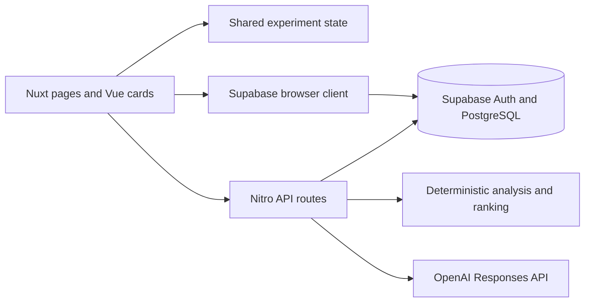

# Halo

Halo is a personal wellness tracker for learning which small changes accompany better days. It brings daily check-ins, habits, personal experiments and reflective AI guidance into a calm interface—helping you move from “I logged it” to “What might be worth trying again?”

> **Project status:** an evolving personal product and portfolio project. The main workflows are implemented, but reliability, evidence calibration, accessibility and database reproducibility still need work. See [Current Status](#current-status) before running or evaluating it.

## Why Halo

Wellness information is easy to collect and harder to interpret. A sleep number or habit streak rarely explains how a change felt, whether it was sustainable, or whether it coincided with a better week.

Halo connects daily observations with small personal experiments. Its emphasis is on self-awareness, manageable actions and recovery, with room for missing days and uncertain results.

## What Halo Does

- Records daily sleep, movement, hydration, outdoor time, mood, energy and stress.
- Tracks habits and a few weekly goals.
- Displays snapshots, trends and descriptive patterns across your check-ins.
- Supports focused experiments with baseline and intervention periods.
- Combines measured changes with your subjective review.
- Generates contextual daily and weekly reflections through server-side AI calls.

## Key Features

**Daily check-in.** Optional numeric measures, 1–5 mood/energy/stress ratings, habit completion and an evening reflection. Today's entry can be updated later.

**Habit system.** Categorized habits, daily or weekly frequency, weekly targets, completion toggles, and archive/restore controls.

**Dashboard and reports.** Daily snapshots, lightweight SVG trends, 7/14/30/90-day report views, and a calm/advanced detail toggle.

**Personal experiments.** A focused lever and target metric, suggested duration, baseline comparison, subjective review, notes and experiment history.

**Reflective coaching.** Daily reflections, structured weekly summaries and suggested weekly goals based on recorded context.

**Next focus.** A deterministic ranking pipeline uses recent changes, available sample counts, previous experiment patterns and how recently a lever was tried.

## How It Works

1. Sign in with an email magic link.
2. Define a few habits and complete a daily check-in.
3. Read your snapshot and reflection; build enough history to compare periods.
4. Choose a small change to explore, such as a consistent sleep routine or outdoor time.
5. Continue recording your days, then end the experiment.
6. Record how it felt before reviewing the numerical changes, save your notes, and decide what to try next.

## Personal Experiments

An experiment records the action being explored, the outcome of interest, its start/end dates and a preceding baseline window. Halo compares available daily measurements across those periods and collects a subjective rating and notes during review.

These are personal before/after observations. They do not establish that an action caused a change, and the current app does not independently measure adherence or control for other events. A useful outcome can be “no clear change” or “helpful, but difficult to maintain.”

The default product flow is one active experiment at a time. Past experiments and pending reviews remain available in history.

## AI Coach

Halo's AI Coach is embedded in reflections and suggestions rather than a conversational chat interface.

- The daily reflection uses today's check-in, completed habits, weekly goals, the evening journal and limited context from yesterday.
- The weekly reflection uses recent changes, habit completion and short journal excerpts to produce wins, points to watch and one next focus.
- Weekly-goal suggestions propose small actions from recent context.
- Finalizing an experiment can generate a short conclusion from its recorded result and review notes.

Generation runs in Nuxt server routes through the OpenAI Responses API. The code currently configures `gpt-4.1-mini`. The visible Next Focus ranking is deterministic; it does not depend on a model call.

AI text is reflective guidance, not medical advice or validated causal analysis. Output validation and fallback behavior exist in some routes; consistent limits, privacy controls and error handling are still being improved.

## What Works

The dashboard's **What Works For You** card displays differences in recorded habits or measures between better days and other days. Reports also include descriptive correlations, while experiment reviews show changes between baseline and intervention periods.

These are related but distinct kinds of evidence. Their confidence rules and presentation are still being consolidated. The dashboard comparison depends on a Supabase `get_what_works` function whose SQL implementation is not currently included in this repository.

## Tech Stack

- **Nuxt 4** with **Vue 3** and **TypeScript**
- **Tailwind CSS** for the interface
- **Supabase Auth** and **PostgreSQL** for identity and persistence
- **Nitro server routes** for orchestration and analytics
- **OpenAI SDK** for generated reflections and suggestions
- **Zod** for request and selected response validation
- **Custom SVG sparklines** for lightweight charts
- **Nuxt i18n** with partial English/Spanish message catalogs

## Architecture



Simple user-owned data operations use the Supabase browser client. Server routes handle reports, experiment transitions, insight computation and model calls. The experiment flow uses Nuxt `useState`; it does not require a separate state-management library.

The main entities are profiles, daily metrics, journal entries, habits and completions, weekly goals, experiments, effects/reviews/events, AI reports and weekly insight snapshots. SQL function definitions and database migrations remain outside the repository at present.

## Data & Privacy

Wellness entries and journal text can be sensitive. OpenAI credentials are kept in private server runtime configuration. The Supabase URL and anon key are public client configuration; database policies must enforce each user's access.

The current check-in save flow also requests an AI reflection, sending today's journal text and relevant wellness context to OpenAI. Other generation actions send the context described in the AI Coach section. A separate AI opt-out/consent control, export and account-deletion workflow are not currently implemented.

Server routes authenticate users and generally scope queries to their identity. RLS policies, database grants and RPC definitions are not included here, so this repository alone does not establish the deployed database's isolation guarantees. Do not treat the project as a production-ready store for sensitive data without reviewing and configuring those protections.

## Screenshots

Screenshots are not yet included. Capture these with synthetic data before publishing the README:

| Suggested image | What it should demonstrate |
|---|---|
| `docs/images/dashboard.png` | Daily snapshot, habits and an active experiment |
| `docs/images/check-in-mobile.png` | A readable mobile check-in and clear save state |
| `docs/images/experiment-review.png` | Baseline/intervention result, subjective review and uncertainty |
| `docs/images/reports.png` | Trends and the calm/advanced evidence view |

<!-- Enable these after the corresponding screenshots exist:


-->

## Local Development

### Prerequisites

- A Node version supported by the installed Nuxt/Vite stack: `^20.19.0 || >=22.12.0`. The audited production build passed with **Node 22.12.0**; the machine's Node 21 default failed.
- npm; `package-lock.json` is the committed dependency lockfile.
- A Supabase project with the required tables, constraints, policies and SQL functions already configured.
- An OpenAI API key for generated reflections and goal suggestions.

**Database setup limitation:** there are currently no migrations or seed scripts in the repository. Creating a blank Supabase project and adding environment variables is insufficient. Obtain and review the project's database definitions first, including `get_metric_correlations`, `get_what_works` and `upsert_experiment_effects_v1`. Do not disable RLS to make setup appear to work.

### Install

From the repository directory:

```bash
npm ci
```

The package's postinstall script runs `nuxt prepare`. The audit used the existing installation rather than verifying a fresh install.

### Environment variables

Create a local `.env` file. It is ignored by Git; an `.env.example` is not yet supplied.

```dotenv
NUXT_PUBLIC_SUPABASE_URL=<your Supabase project URL>
NUXT_PUBLIC_SUPABASE_ANON_KEY=<your Supabase anon key>
NUXT_OPENAI_API_KEY=<your server-side OpenAI API key>
```

Never use a Supabase service-role key as the public anon key. Allow the local magic-link redirect `http://localhost:3000/auth/callback` in your Supabase authentication configuration. Use the corresponding origin/callback for another port or deployment.

Core tracking uses Supabase. Without an OpenAI key, reflection/goal generation is unavailable; the current save flow can report an AI error after data has already saved. Optional experiment conclusion generation can fall back to no conclusion.

### Run locally

```bash
npm run dev
```

Open `http://localhost:3000/auth` to access sign-in. The audited version has a known signed-out dashboard crash at `/`; see Current Status.

### Build and preview

```bash
npm run build
npm run preview
```

The production build generates a Nitro server in `.output/`. Configure the same runtime variables in the hosting environment; do not assume a production server automatically reads a development `.env` file.

`npm run generate` also exists, but this application depends on authenticated Nitro API routes. A static-only host is not a complete deployment of the current product.

### Tests and type checking

There are currently no `test`, `lint`, or `typecheck` scripts and no committed test suite. The audit's supplementary server-only TypeScript check reported errors; a passing production build does not imply passing type checks or working user flows.

## Project Structure

```text
pages/                 Dashboard, check-in, habits, experiments, reports and auth
layouts/               Shared navigation and onboarding host
components/            Dashboard cards, experiment dialogs and SVG charts
composables/           Shared experiment flow, onboarding and suggestions
server/api/            Authenticated data, report, experiment and AI endpoints
server/lib/ai/         Deterministic candidate ranking and evidence helpers
server/lib/time/       Week-key and date-window helpers
server/utils/          Report serialization and review utilities
assets/css/            Tailwind entry styles
i18n/locales/          Partial English and Spanish messages
public/                Logo assets, favicon and robots file
docs/audit/            Product/technical audit and this README proposal
```

## Current Status

Halo has implemented tracking, habits, reports, experiment lifecycle screens and contextual AI generation. It remains a development project, with these important limitations identified in the September 2026 audit:

- The production build passes on supported Node, but signed-out home and some nullable-data paths fail at runtime.
- Some multi-step saves can partially succeed; experiment note/DTO contracts need consolidation.
- Confidence labels, score scales and analytical denominators need correction before presenting insights as dependable.
- Generated Markdown on check-in needs a safe rendering boundary.
- Database migrations, policies, RPC definitions and generated types are not committed.
- Automated tests/CI, complete mobile/keyboard QA, and full localization are not implemented.
- The configured `nuxt-markdown-render` module is incompatible with Nuxt 4 and is disabled during build.

These are known engineering tasks, not advertised capabilities. Update this section as fixes are verified.

## Roadmap

1. Stabilize authentication transitions, optional check-ins and atomic data saves.
2. Commit the database contract and add focused type/integration/browser checks.
3. Make the experiment loop and confidence/evidence presentation consistent.
4. Separate saving from optional AI generation and add privacy/cost controls.
5. Finish mobile/accessibility work and publish a synthetic-data demo.

## About This Project

Halo is a personal portfolio and product project exploring full-stack product engineering, thoughtful wellness UX and data-informed personal experimentation. It demonstrates how Vue/Nuxt interfaces, Supabase persistence, deterministic analysis and AI narration can work together—and the care needed to turn those pieces into a reliable product.
